<div align="center">

# 🛠️RV32I Multi-Cycle Design

</div>

# 🗂️Contents
> 해당 목차를 누르시면 원하는 내용을 바로 이동할 수 있습니다
1. [👨‍💻Who Made?](#who-made)
2. [🌳개발환경](#개발환경)
3. [🛠️개발과정](#️개발과정)
4. [🖥️About RISC-V](#️about-risc-v)
5. [🏛️Multi-Cycle RV32I: HW Architecture](#️multi-cycle-rv32i-hw-architecture)   
6. [✔️Simulation Verification](#️simulation-verification)
7. [🔍Application Verification](#application-verification)
8. [🚀Trouble Shooting](#trouble-shooting) 

# Who Made?

|                                                                                                    **Hyenwoo Choi**                                                                                                    |
| :--------------------------------------------------------------------------------------------------------------------------------------------------------------------------------------------------------------------: |
| [ </br> @HyenWoo Choi](https://github.com/drgn88) |

# 개발환경

|                          Text Editor                          |                               설계 언어                                |                        Application 검증                        |                          Simulation                          |
| :-----------------------------------------------------------: | :--------------------------------------------------------------------: | :------------------------------------------------------------: | :----------------------------------------------------------: |
|                          **Vscode**                           |                           **System Verilog**                           |                             **C**                              |                          **Verdi**                           |
|  |  |  |  |

# 개발과정

- [0. RV32I 기본내용 정리](https://github.com/drgn88/ai-btcamp-TIL/blob/main/ai_HW_verilog/TIL/RV32I_CPU_%EC%84%A4%EA%B3%84/0.RV32I_Basic.md)
- [1. RV32I R-Type 설계](https://github.com/drgn88/ai-btcamp-TIL/blob/main/ai_HW_verilog/TIL/RV32I_CPU_%EC%84%A4%EA%B3%84/1.RV32I_R_Type.md)
- [2. RV32I I-Type 설계](https://github.com/drgn88/ai-btcamp-TIL/blob/main/ai_HW_verilog/TIL/RV32I_CPU_%EC%84%A4%EA%B3%84/2.RV32I_I_Type.md)
- [3. RV32I B-Type 설계](https://github.com/drgn88/ai-btcamp-TIL/blob/main/ai_HW_verilog/TIL/RV32I_CPU_%EC%84%A4%EA%B3%84/3.RV32I_B_Type.md)
- [4. RV32I LU/AU, J/JL-Type 설계](https://github.com/drgn88/ai-btcamp-TIL/blob/main/ai_HW_verilog/TIL/RV32I_CPU_%EC%84%A4%EA%B3%84/4.RV32I_LU_AU_J_JL_Type.md)
- [5. RV32I L/S-Type 설계](https://github.com/drgn88/ai-btcamp-TIL/blob/main/ai_HW_verilog/TIL/RV32I_CPU_%EC%84%A4%EA%B3%84/5.RV32I_L_S_Type.md)
- [6. RV32I Multi-Cycle 설계](https://github.com/drgn88/ai-btcamp-TIL/blob/main/ai_HW_verilog/TIL/RV32I_CPU_%EC%84%A4%EA%B3%84/6.RV32I_Multi_Cycle.md)

# About RISC-V

|                       RISC-V                        |
| :-------------------------------------------------: |
|  |

## 1. RISC-V란?
- **RISC-V (Reduced Instruction Set Computer - Five)**  
  → RISC 철학을 기반으로 설계된 **오픈소스 명령어 집합 구조(ISA)**  
- 기존의 x86(인텔/AMD), ARM(모바일)과 같은 ISA와 달리, **무료로 사용 가능**하고 누구나 확장·수정 가능  
- **2010년 캘리포니아 버클리 대학**에서 시작됨  

---

## 2. 특징
- **오픈소스 ISA** → 라이선스 비용 없음
- **모듈화 설계** → 필요한 확장만 선택 가능
- **단순성** → 명령어 집합이 간결하고 학습·구현 용이
- **이식성** → 임베디드부터 슈퍼컴퓨터까지 다양한 시스템에 적용 가능
- **확장성** → 기본 명령어 외에 벡터, 부동소수점, 암호화 확장 등 선택 가능

---

## 3. 명령어 세트 구조
### 기본 명령어 세트
- **RV32I** : 32비트 정수 명령어 세트
- **RV64I** : 64비트 정수 명령어 세트

---

## 4. RISC-V 구조적 특징
- **레지스터 기반**
  - 32개 범용 레지스터 (x0 ~ x31)
  - x0은 항상 0 고정
- **Load/Store 구조**
  - 메모리 접근은 `load/store` 명령만 가능
- **고정 길이 명령어**
  - 기본: 32비트
  - 압축(C 확장): 16비트 가능
- **심플한 파이프라이닝 구조** → 고속 동작

---

## 5. RISC-V의 장점과 단점
### 장점
- 무료/오픈소스 → 반도체 스타트업, 학계에서 적극 활용
- 단순하고 모듈화 → 학습 및 커스터마이즈 용이
- 생태계 확장 중 → OS, 컴파일러, 하드웨어 지원 증가

### 단점
- ARM, x86 대비 **생태계 규모 작음**
- 아직까지는 **상용 제품/시장 점유율 낮음**
- 일부 고성능 애플리케이션에서 최적화 부족

---

## 6. 활용 사례
- **임베디드 시스템** (IoT, 마이크로컨트롤러)
- **AI/ML 가속기** (맞춤형 벡터/행렬 연산 ISA 추가 가능)
- **슈퍼컴퓨터** (유럽·중국에서 RISC-V 기반 HPC 연구 진행 중)

---

# Multi-Cycle RV32I: HW Architecture

|              HW Block Diagram               |
| :-----------------------------------------: |
| 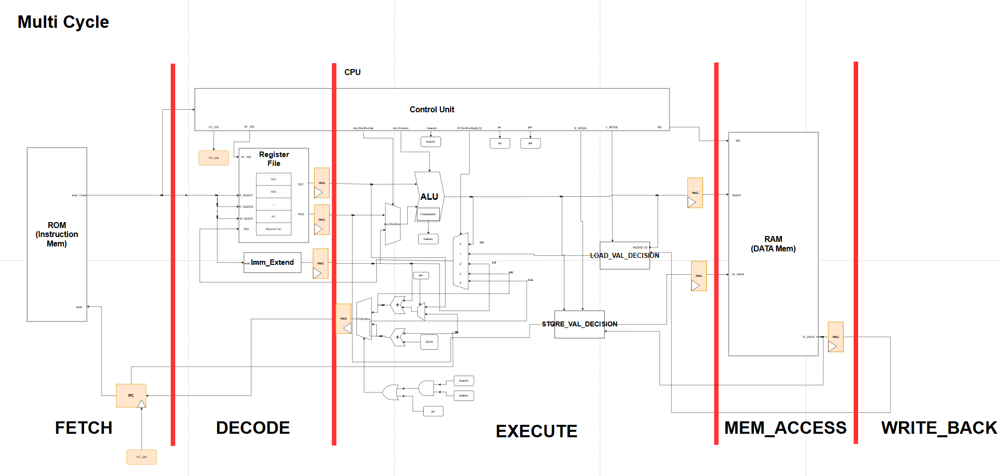 |

## 🆚Sigle-Cycle Vs Multi-Cycle

|                              |             Single-Cycle             |                         Multi-Cycle                         |
| :--------------------------: | :----------------------------------: | :---------------------------------------------------------: |
|           **특징**           | 모든 유형의 명령어를 1Clk안에 수행함 | 명령어의 연산을 5단계로 나눔<br>Single보다 CL의 Path가 짧음 |
| **Combinational Logic Path** |               매우 긺                |        Stage앞 뒤로 Register 존재<br>Single보다 짧음        |
|          **Speed**           |                 느림                 |                      빠름(than Single)                      |

🪜Stage 별 설명
---
☸️FETCH
---

### PC
- 기존에 1Clk마다 명령어 처리
- Multi-Cycle에서는 명령어 타입별로 소모 클럭 수가 다름
  - ❗매 클럭마다 PC를 업데이트해주면 안됨
  - PC_En 신호로 조절

🗝️Decode
---
- **Control Unit**에서 Instruction Code를 해석하여 제어신호 출력
- Register File의 출력은 Decode Stage에서 대기 필요
  - Reegister를 두어 1clk 늦춤

🧮Execute
---
- **ALU** 및 연산 로직에서 Control Unit에서 받은 제어신호를 토대로 연산 수행 시작
- 다음 Stage인 RAM에 접근하기 전에, 1Clk 대기 필요
  - Pipe Register를 둠

📂Memory Access
---
- RAM에 접근하여, Register File에서의 Data를 저장함
- Read Data의 경우 Write Back이 수행되기 전까지 대기 필요
  - Register를 두어 1Clk 대기

✍️Write Back
---
- RAM에서 읽어온 Data(Read Data)를 Register File에 저장함

## Control Logic FSM

|                     FSM                      |
| :------------------------------------------: |
| 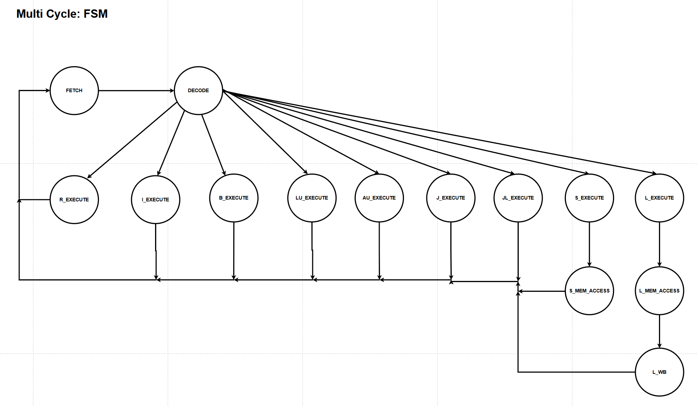 |

# Simulation Verification

## 1. R-Type

### SRA & SRL

|               Simulation Result               |
| :-------------------------------------------: |
| 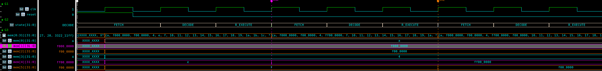 |

|    &nbsp;    | Test_Vector | Shift_Value |     SRA     |     SRL     |
| :----------: | :---------: | :---------: | :---------: | :---------: |
| **Register** |     X1      |     X3      |     X4      |     X5      |
|  **Value**   | 0xF000_0000 |     0x4     | 0xFF00_0000 | 0x0F00_0000 |

### SLT & SLTU

|               Simulation Result                |
| :--------------------------------------------: |
|  |

|    &nbsp;    |             Test_Vector             | 비교 대상 |  SLT  | SLTU  |
| :----------: | :---------------------------------: | :-------: | :---: | :---: |
| **Register** |                 X1                  |    X0     |  X6   |  PC   |
|  **Value**   | Signed: -8<br>Unsigned: 42944967288 |    0x0    |  0x1  |  0x0  |


## 2. I-Type

### SRAI & SRLI

|                Simulation Result                |
| :---------------------------------------------: |
| 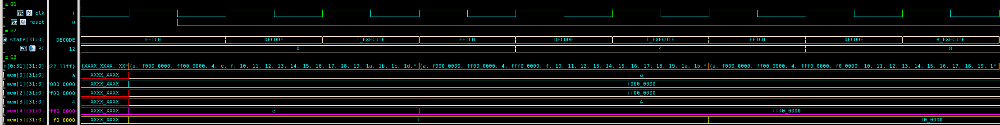 |

|    &nbsp;    | Test_Vector | Immediate Value |    SRAI     |    SRLI     |
| :----------: | :---------: | :-------------: | :---------: | :---------: |
| **Register** |     X1      |       Imm       |     X6      |     X7      |
|  **Value**   | 0xF000_0000 |       0x8       | 0xFFF0_0000 | 0x00F0_0000 |

## 3. B-Type

|               Simulation Result                |
| :--------------------------------------------: |
| 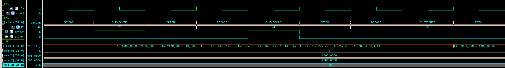 |

|    &nbsp;    |             Test_Vector             | 비교값 | Immediate Value |  초기 PC   | BLTU  |  BLT  |
| :----------: | :---------------------------------: | :----: | :-------------: | :--------: | :---: | :---: |
| **Register** |                 X1                  |   X0   |       Imm       | Initial PC |  PC   |  PC   |
|  **Value**   | Signed: -16<br>Unsigned: 4294967280 |  0x0   |       12        |     20     |  24   |  36   |

## 4. LU/AU-Type

|              Simulation Result              |
| :-----------------------------------------: |
| 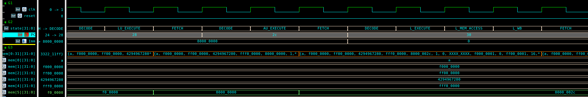 |

|    &nbsp;    | Immediate Value |  LUI  | Befor AU PC |     AUI     |
| :----------: | :-------------: | :---: | :---------: | :---------: |
| **Register** |       Imm       |  X5   |     PC      |     X5      |
|  **Value**   |    0x1000_0     | 0x2C  | 0x8000_0000 | 0x8000_002C |

## 5. J/JL-Type

|                Simulation Result                |
| :---------------------------------------------: |
| 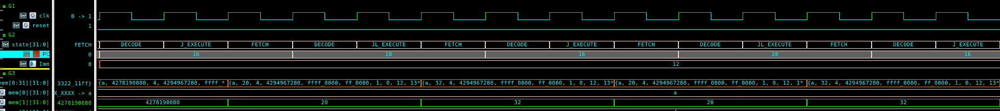 |

|      &nbsp;      | Retrun Address |   PC   |
| :--------------: | :------------: | :----: |
|   **Register**   |     **X1**     | **PC** |
| **J_Before_PC**  |       XX       |   16   |
|  **J_After_PC**  |       20       |   28   |
| **JL_Before_PC** |       20       |   28   |
| **JL_After_PC**  |       32       |   16   |

## 6. L/S Type

### SW/LW

|              Simulation Result              |
| :-----------------------------------------: |
| 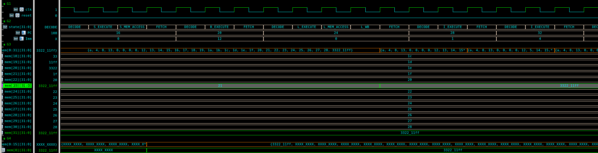 |

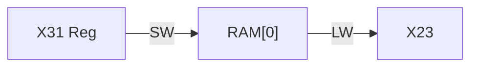

### LB

|            Simulation Result             |
| :--------------------------------------: |
| 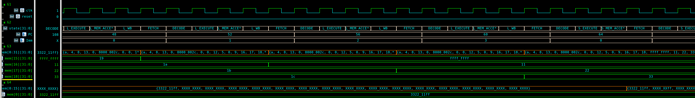 |

|   &nbsp;   |             Data              |
| :--------: | :---------------------------: |
| **RAM[0]** |          0x3322_11FF          |
|  **X15**   | 0xFFFF_FFFF<br>Sign Extension |
|  **X16**   |             0x11              |
|  **X17**   |             0x22              |
|  **X18**   |             0x33              |

### SB

|            Simulation Result             |
| :--------------------------------------: |
| 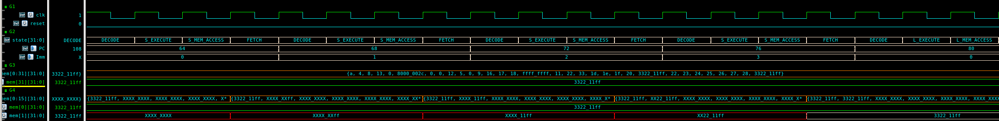 |

|      &nbsp;       |    Data     |
| :---------------: | :---------: |
|      **X31**      | 0x3322_11FF |
| **RAM[0]:1st SB** | 0xXXXX_XXFF |
| **RAM[0]:2nd SB** | 0xXXXX_11FF |
| **RAM[0]:3rd SB** | 0xXX22_11FF |
| **RAM[0]:4th SB** | 0x3322_11FF |

### LH

|            Simulation Result             |
| :--------------------------------------: |
| 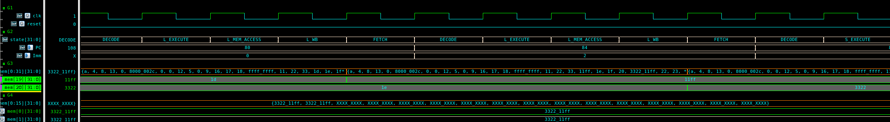 |

|   &nbsp;   |    Data     |
| :--------: | :---------: |
|  **X31**   | 0x3322_11FF |
| **RAM[0]** | 0x3322_11FF |
|  **X19**   |   0x11FF    |
|  **X20**   |   0x3322    |

### SH

|            Simulation Result             |
| :--------------------------------------: |
|  |

|       &nbsp;       |    Data     |
| :----------------: | :---------: |
|      **X31**       | 0x3322_11FF |
| **RAM[2]: 1st SH** | 0xXXXX_11FF |
| **RAM[2]: 2nd SH** | 0x3322_11FF |

# Application Verification

## 🫧Application: Bubble Sort

| Test Vector |    Data     |
| :---------: | :---------: |
|  arData[5]  | [5,4,3,2,1] |

|                   Array Initialize                   |
| :--------------------------------------------------: |
| 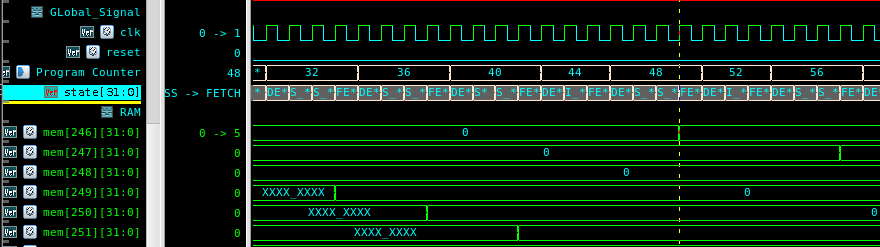 |

- 배열 데이터가 RAM에 공간을 할당받고, 0으로 초기화되는 것을 확인할 수 있다


|                     초기값 할당                     |
| :-------------------------------------------------: |
| 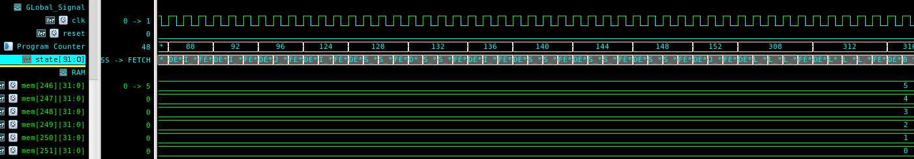 |

- 배열의 초기값 [5,4,3,2,1]이 할당받은 RAM 공간에 채워진다

|                 Bubble Sorting 후                  |
| :------------------------------------------------: |
| 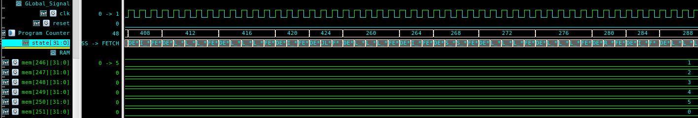 |

- 배열 Data가 Sorting되어 오름차순 [1,2,3,4,5] 순으로 정렬된 것을 확인할 수 있다

# Trouble Shooting

## 1️⃣Store Value Decision Module
- Store Value Decision은 RAM에 쓸 주소의 데이터를 미리 읽어와서 저장할 데이터 부분을 교체함
- Multy-Cycle의 경우
  - S_Execute에서 Store할 데이터를 교체하는 작업을 수행함
  - 이 때, Execute단계에서 ```ALU```에서 연산된 주소의 RAM 데이터를 읽어와야함
  - ❗그러나 Multi-Cycle로 바꾸면서 RAM address 입력부에 Register를 둠
  - ⭐Execute단계에서 연산된 주소의 Data를 읽어와야하지만 Register로 인해 이전 주소의 데이터를 읽어옴
    - 엉뚱한 주소의 데이터를 읽어오는 문제점
- RAM 데이터 바로 읽어서 해결(레지스터 출력을 읽어오지 않음)

## 2️⃣Memory Multiple Driving Problem(Register File)

### Vivado에서 코드
```verilog
    initial begin  // for simulation test
        for (int i = 0; i < 32; i++) begin
            mem[i] = 10 + i;
        end
        mem[31] = 32'h3322_11ff;
        mem[1]  = 32'h0000_0004;
        mem[2]  = 32'h0000_0008;
    end

    always_ff @(posedge clk) begin
        if (we) mem[WA] <= WD;
    end
```
- 기존 Vivado에서 Simulation을 위해 Register File의 일부 주소에 데이터를 ```initial```을 이용해 넣어줌
- Vivado에서는 ```always``` block과 ```initial``` block에서 동시에 Memory에 write를 해도 문제X
- **VCS Verdi**
  - Multiple Drive Error 발생❗
  - Coder는 ```always```와 ```initial```에서 동시에 memory의 동일 주소에 접근하지 않는다는 것을 앎
  - **Compiler** 입장에서는 이 사실을 알지 못함
  - 그래서 initial에서 초기값을 주지않고, always 문안에 ```reset```이 들어올 때, 초기값을 세팅해줌

### 수정 후 코드(in VCS Verdi)
```verilog
    always_ff @(posedge clk) begin
        if(test_reset) begin
            for (int i = 0; i < 32; i++) begin
            mem[i] = 10 + i;
        end
        mem[31] = 32'h3322_11ff;
        mem[1]  = 32'h0000_0004;
        mem[2]  = 32'h0000_0008;
        end
        else if (we) mem[WA] <= WD;
    end
```